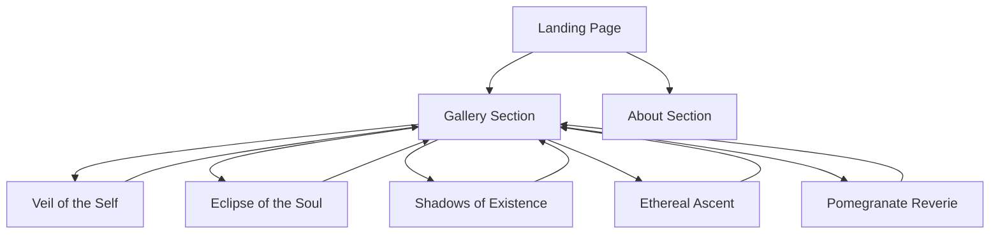
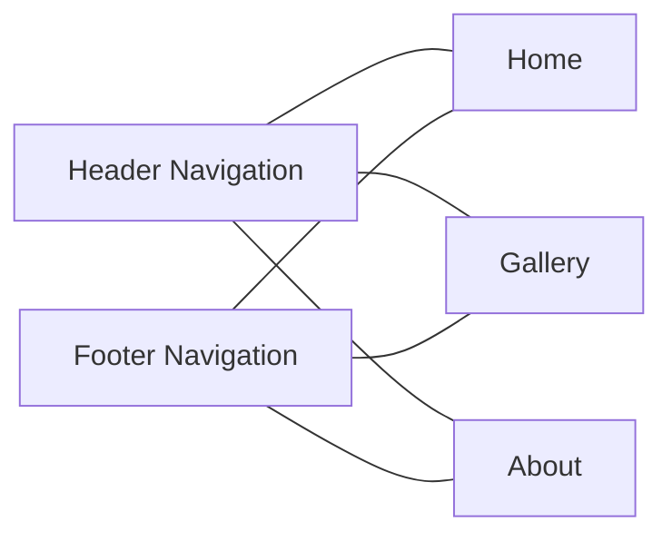

# Design Plan for Baab Studio Website Redesign

## 1. Visual Direction

The redesign will maintain and enhance the existing aesthetic found in the artwork pages, which includes:

- **Color Palette**:
  - Primary Background: Off-white (#F7F7F2)
  - Text Colors: Dark grey (#4A4A4A) for body text
  - Accent Colors: Muted greenish-brown (#2E4A46) for headings
  - Existing tan/brown elements from landing page (#5a4d41, #eae7dc)

- **Typography**:
  - Continue using 'Lato' font family for its clean, modern aesthetic
  - Hierarchy will use various weights of Lato (400 for body text, 700 for headings)
  - Maintain current text sizing but adjust for responsive layouts

- **Visual Elements**:
  - Embrace minimalism and negative space
  - Use subtle transitions and hover effects to enhance interactivity
  - Incorporate horizontal dividers as seen in the current landing page

## 2. Information Architecture



The site will follow a simple, intuitive structure:
- Landing page serves as the main hub
- Navigation allows access to all sections
- Gallery provides thumbnails linking to individual artwork pages
- Artwork pages include navigation back to gallery and other pages

## 3. Key Sections for Landing Page

### 3.1 Header Section
- Logo "baab studio" (lowercase as specified) positioned top left
- Minimal navigation menu aligned to the right
- Clean, fixed header that remains accessible throughout scrolling

### 3.2 Hero Section
- Large, impactful hero image or slideshow featuring key artworks
- Minimal text overlay with artist's name and brief tagline
- Subtle animation to draw attention without overwhelming the artwork

### 3.3 Gallery Preview Section
- Grid layout showcasing thumbnails of all 5 artworks
- Each thumbnail links to its dedicated artwork page
- Hover effects reveal artwork title and year
- "View All" option or pagination if collection expands

### 3.4 About Preview Section
- Brief artist introduction with a professional photo
- Short paragraph highlighting artistic themes (mindfulness, cultural identity, spiritual exploration)
- "Read More" link to full About page

### 3.5 Footer Section
- Copyright information
- Minimal social media links if applicable
- Return to top link
- Secondary navigation

## 4. Navigation Structure



- **Primary Navigation**: Simple horizontal menu in header with Home, Gallery, and About links
- **In-page Navigation**: "Back to Gallery" links on individual artwork pages
- **Secondary Navigation**: Smaller version of main navigation in footer

## 5. Content Hierarchy and Layout

### Landing Page Layout
```
+----------------------------------+
|  LOGO            NAVIGATION MENU |
+----------------------------------+
|                                  |
|           HERO SECTION           |
|           [Featured Art]         |
|                                  |
+----------------------------------+
|                                  |
|        GALLERY PREVIEW           |
|  +------+  +------+  +------+    |
|  |Art 1 |  |Art 2 |  |Art 3 |    |
|  +------+  +------+  +------+    |
|  +------+  +------+              |
|  |Art 4 |  |Art 5 |              |
|  +------+  +------+              |
|                                  |
+----------------------------------+
|                                  |
|         ABOUT PREVIEW            |
|  [Photo]   [Brief Description]   |
|                                  |
+----------------------------------+
|           FOOTER                 |
+----------------------------------+
```

### Artwork Page Layout (maintaining current layout with additions)
```
+----------------------------------+
|  LOGO            NAVIGATION MENU |
+----------------------------------+
|                                  |
|           ARTWORK TITLE          |
|                                  |
|           [ARTWORK IMAGE]        |
|                                  |
|           ARTWORK INFO           |
|                                  |
|           DESCRIPTION            |
|                                  |
|           NOTABLE ELEMENTS       |
|                                  |
|           INTERPRETATION         |
|                                  |
|        [BACK TO GALLERY LINK]    |
|                                  |
+----------------------------------+
|           FOOTER                 |
+----------------------------------+
```

## 6. Artistic Theme Integration

To reflect Ronak's artistic themes:

- **Mindfulness**:
  - Use of negative space and balanced layouts
  - Clean transitions between sections
  - Carefully selected typography for readability and focus

- **Cultural Identity**:
  - Subtle cultural motifs in dividers or decorative elements
  - Space for multilingual content where appropriate
  - Visual connections between artworks that explore heritage

- **Spiritual Exploration**:
  - Gentle transitions between sections suggesting transformation
  - Gold accent colors where appropriate (as seen in artwork "Eclipse of the Soul")
  - Navigation that encourages exploration and discovery

## 7. Responsive Design Strategy

Following a mobile-first approach, the website will be designed with the following responsive strategies:

### 7.1 Breakpoints

The site will use the following breakpoints to ensure optimal viewing across devices:

- **Mobile (Base)**: Up to 599px
  - Single column layout
  - Stacked content sections
  - Hamburger menu for navigation
  - Full-width images

- **Tablet (Small)**: 600px - 899px
  - Two-column gallery grid
  - Expanded navigation with text labels
  - Balanced use of whitespace

- **Tablet (Large)**: 900px - 1199px
  - Three-column gallery grid
  - Full navigation menu
  - More generous spacing between elements

- **Desktop**: 1200px and above
  - Full desktop experience
  - Enhanced hover states and interactions
  - Optimal viewing of artwork details

### 7.2 Implementation Approach

- Use `em` or `rem` units for typography to allow consistent scaling
- Implement CSS Grid and Flexbox for responsive layouts
- Use relative units for containers and spacing
- Set responsive image handling with `max-width: 100%` and appropriate `srcset` attributes
- Ensure touch targets are at least 44px × 44px on mobile devices

### 7.3 Component-Specific Adaptations

- **Navigation**:
  - Mobile: Hamburger menu with slide-out drawer
  - Tablet: Compact horizontal menu
  - Desktop: Full horizontal menu with hover effects

- **Gallery Grid**:
  - Mobile: Single column, scrollable
  - Tablet: 2x2 or 2x3 grid
  - Desktop: 3x2 or larger grid with hover effects

- **Hero Section**:
  - Mobile: Simplified hero with reduced text
  - Tablet: Medium-sized hero with standard text
  - Desktop: Full-sized hero with enhanced typography

- **Typography Scaling**:
  - Base font-size: 16px (1rem)
  - Mobile headings: 1.5rem - 2rem
  - Tablet headings: 2rem - 2.5rem
  - Desktop headings: 2.5rem - 3rem

## 8. Technical Implementation Notes

- Maintain clean, semantic HTML structure
- Use CSS for styling, avoiding unnecessary frameworks
- Implement smooth transitions for page navigation
- Ensure proper image optimization for artwork display
- Set up flexible container layouts for responsive design

## 9. Implementation Phases

1. **Phase 1: Core Structure and Design**
   - Create the responsive HTML/CSS structure
   - Implement header and navigation
   - Develop the landing page layout

2. **Phase 2: Artwork Integration**
   - Set up gallery preview section
   - Connect artwork pages to main navigation
   - Implement "Back to Gallery" links

3. **Phase 3: About Section and Refinement**
   - Create About section preview on landing page
   - Develop full About page
   - Add final styling touches and animations

4. **Phase 4: Testing and Deployment**
   - Test across multiple device sizes
   - Verify all links and navigation
   - Optimize performance
   - Deploy the complete site
